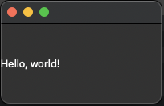

# Guide: Uploading a Python app to the Mac App Store (October 2022)

## Table of Contents

- [Introduction](#introduction)
- [General Prerequisites](#general-prerequisites)
- [Libraries and Tools](#libraries-and-tools)
- [Running the App Locally](#running-the-app-locally)
- [Packaging the App](#packaging-the-app)
- [Pyinstaller .spec file](#pyinstaller-spec-file)
- [Entitlements .plist file](#entitlements-plist-file)
- [Running Pyinstaller and Codesigning](#running-pyinstaller-and-codesigning)


## Introduction

**Note**: if you think that you've already got a good understanding of the process of building/codesigning, you can skip to
the [Running Pyinstaller and Codesigning](#running-pyinstaller-and-codesigning) section, where you can simply run 
my build script to package your app for the Mac App Store.

This guide will walk you through the process of uploading a Python app to the Mac App Store. It is based on my 
personal experience of struggling to upload an app successfully. One might think that uploading a Python app to the
Mac App Store would be easy. After all, Python is one of the most popular languages in the world, and macOS is one of 
the most popular operating systems. However, complications with app sandboxing and the app signing process make 
such an endeavour difficult. It is crucial to specify the correct build parameters and entitlements in order for 
the app to run properly and be accepted by the Mac App Store.

Many of the guides on the internet that explain how to do this are outdated, and the process of deploying a Python app 
has changed significantly since they were written. This guide is intended to be roughly up-to-date and accurate as of
October 2022, and uses modern tools and libraries (e.g. Python 3.9, PyInstaller, PySide6).

The goal of this guide is to allow you to, at the very least, upload a Python app to the Mac App Store using
Transporter. However, just because an app is successfully uploaded through Transporter does not mean it will be accepted
by Apple. This guide will not cover the process of getting your app accepted by Apple, which is its own beast.

Finally, the app we will upload to the App Store will be a simple Python app that shows "Hello World" in a UI window. 
This app is meant to be a building block for you to use to build your own app, and as such, I've kept it incredibly
barebones and simple.


## General Prerequisites

* You must have a Mac Developer account. This is a paid account, and you must pay an annual fee to keep it active.
* You should have an app registered in the App Store Connect profile. You can find a link to this here:
https://appstoreconnect.apple.com/apps. If you don't have an app registered, you can create one by clicking the
"Add App" button in the top right corner of the page, and setting up the app. 
* Once you have an app registered in the App Store Connect profile, you should have a bundle ID. This is a unique
identifier for your app, and it is used to identify your app in the App Store. You can find your bundle ID by
clicking on your app in the App Store Connect profile, and then clicking on the "General" tab. The bundle ID is
listed under the "App Information" section. We will use this bundle ID later in the guide.


## Libraries and Tools

* MacOS (obviously) - Please note, I am using my personal M1 Mac (macOS Monterey) which uses a chip with the ARM64 
architecture. If you are using an Intel-based Mac, you might have to slightly change a Pyinstaller spec file to use the
Intel architecture instead of ARM64. I have not tested this, so I cannot guarantee that it will work, but it should be
possible.
* XCode Command Line Tools - You can install them by running `xcode-select --install` in a
terminal
* Python 3.9 - I am using Python compiled to run on ARM64, since I am using an M1 Mac, but you may be able to use 
Python compiled for Intel's x86_64 architecture. Again, I have not tested this, so be aware of complications there. 
* Pyside6 - You can install it by running `pip install -r requirements.txt` in a terminal in this project's
directory.
* PyInstaller - You can install it by running `pip install -r requirements.txt` in a terminal in this project's
directory.


## Running the app locally

The `main.py` file contains a simple Python app that shows "Hello World" in a UI window. Clone this repository and 
make sure to install the project requirements using `pip install -r requirements.txt` in a terminal. Then, you can run
the app by running `python main.py`, and you should see a window pop up with "Hello World" in it.

It should look something like this:



## Packaging the app

### Pyinstaller .spec file

The first step in packaging the app is to create a Pyinstaller .spec file. This file contains information about how
Pyinstaller should package the app. You can find the .spec file (called `main.spec`) in this repository. 

Getting the contents of this file right was quite tricky, and I had to do a lot of trial and error to get it to work.
You should, for the most part, be able to use it as a template for your own app. However, there are a few things you
should know about this file:

* The bundle identifier is something you should change to match your app's bundle identifier. You can set it by setting 
the value in the plist dictionary section of the .spec file, under the key `CFBundleIdentifier`
* The added files section is where you should add any files that your app needs to run
* The app category is something you should change to match your app's category. The category value is under the key 
`LSApplicationCategoryType` in the plist dictionary section of the .spec file.
* If you deviate from the default .spec file I've created, be very careful about what you change. I've found that 
certain keys/values will cause the app to crash if they are not set correctly. For example, if you change the 
`console=False` to `console=True`, the app will crash if you attempt to open it after you codesign it. 


### Entitlements .plist file

The next step is to create an entitlements .plist file. This file contains information about the app's entitlements.
Entitlements are basically permissions that the app needs to run. You can find the .plist file (called
`entitlements.plist`) in this repository. You should be able to use this file as is, for the most part.


### Provisioning Profile

You will also need to create a provisioning profile. This is a file that contains information that uniquely ties 
developers and devices to an authorized Development Team and enables a device to be used for testing, and it is used to
sign the app. You can create a provisioning profile by going to the "Certificates,
Identifiers, & Profiles" section of the Apple Developer website: 
https://developer.apple.com/account/resources/profiles/list. Then, click on "Profiles" in the left
sidebar, and click the "+" button. Then, select "Mac App Store" as the type of provisioning
profile, and select your app's bundle ID. Then, click "Continue", and then "Generate". This will create a provisioning
profile for your app. You can download it by clicking the "Download" button in the top right corner of the page.


### Creating an icon

The next step is to create an icon for your app. You can use any image editor to create an icon. However, the icon
must be in the .icns format. You can convert an image to the .icns format by using the `iconutil` command. For more 
details about how to do this, see this gist: https://gist.github.com/jamieweavis/b4c394607641e1280d447deed5fc85fc


### Running Pyinstaller and Codesigning

I've created a python script called `build.py` that will run Pyinstaller and codesign the app. You will need two 
certificates to run this script: the 3rd party Mac Developer Application certificate, and the 3rd party Mac Developer
Installer certificate. You can find these certificates by going to the "Certificates, Identifiers, & Profiles" section
located here: https://developer.apple.com/account/resources/certificates/list. If you haven't created these certificates
yet, you can probably find tutorials online on how to do so (and I may include more details on this in the future) and 
may involve creating a Certificate Signing Request (CSR) locally and then uploading it to the Apple Developer website.

Once you have the certificates, you can run the `build.py` script in this repository by running `python build.py` in a
terminal. A sample run might look like this:

```bash
$ python build.py \
    --app_name "Testapp" \
    --version "0.0.1" \
    --spec_file "main.spec" \
    --entitlements "entitlements.plist" \
    --provisioning_profile "testapp_provision.provisionprofile" \
    --app_certificate "3rd Party Mac Developer Application: John Smith (L42TK32G7A)" \
    --installer_certificate "3rd Party Mac Developer Installer: John Smith (L42TK32G7A)" \
    --output_dir "dist"
```

## More details to follow...